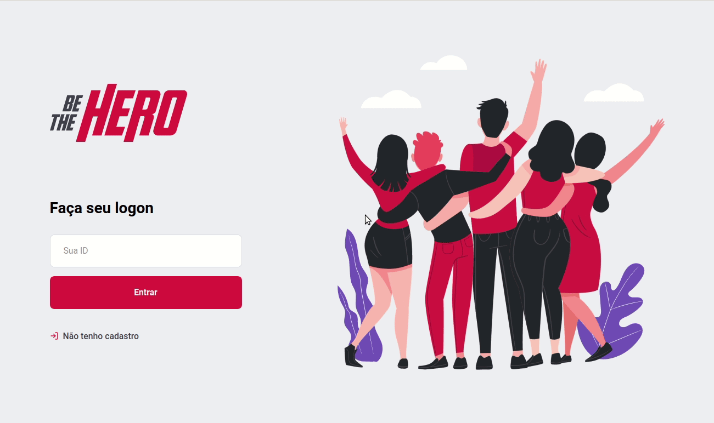
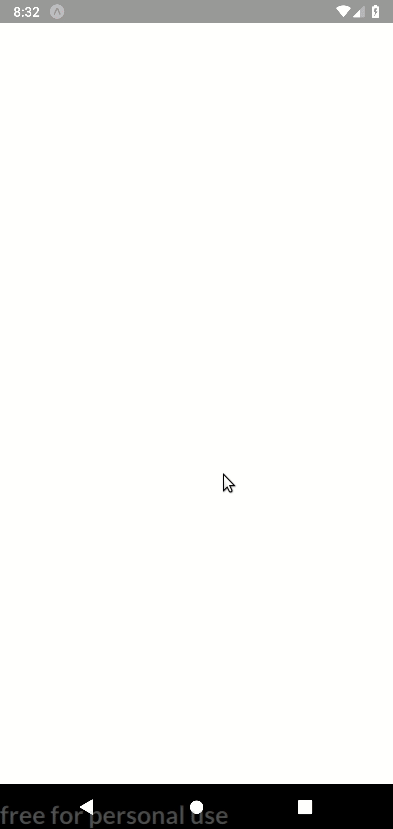

<h1 align="center">:punch: Be The Hero</h1>

<h2 align="center">
	Projeto desenvolvido na 11.º edição da <a href="https://rocketseat.com.br/">Semana Omnistack</a>.
</h2>

	<a href="https://app.netlify.com/sites/be-the-hero-omnistack/deploys">
		</img>
	</a>
	<a target="_blank" href="https://www.codacy.com/manual/viniciusrodrigues1a/omnistack-11?utm_source=github.com&amp;utm_medium=referral&amp;utm_content=viniciusrodrigues1a/omnistack-11&amp;utm_campaign=Badge_Grade">
		</img>
	</a>
	<a href="./LICENSE">
		</img>
	</a>
	</img>

	

		<a target="_blank" href="https://be-the-hero-omnistack.netlify.com/">
		Live on Netlify
		</a>
	

<h3 align="center">Frontend Web</h3>
<h4 align="center">(Para as ongs poderem se cadastrar e cadastrar novos casos.)</h4>

	</img>

<h3 align="center">Frontend Mobile</h3>
<h4 align="center">(Para os usuários poderem visualizar os casos existentes e entrar em contato.)</h4>

	</img>

## :page_facing_up: Índice

- [Sobre](#about)
- [Primeiros passos](#getting_started)
- [Tecnologias usadas](#built_using)
- [Licença](#license)

## 🧐 Sobre 

Projeto que visa conectar pessoas com vontade de ajudar financeiramente ONGS.

## 🏁 Primeiros passos 

Estas instruçōes te darão uma cópia funcional do projeto na sua máquina local para desenvolvimento e testes.

* Configurando o [BACKEND](./backend/README.md). 

* Configurando o [FRONTEND WEB](./frontend/README.md).

* Configurando o [FRONTEND MOBILE](./mobile/README.md). 

## :computer: Tecnologias usadas <a name="built_using">

* NodeJS
* ReactJS
* React Native
* Styled-Components
* KnexJS
* SQLite

## :memo: Licença 

Esse projeto está sob a licença MIT. Veja o arquivo [LICENSE](LICENSE) para mais detalhes.
